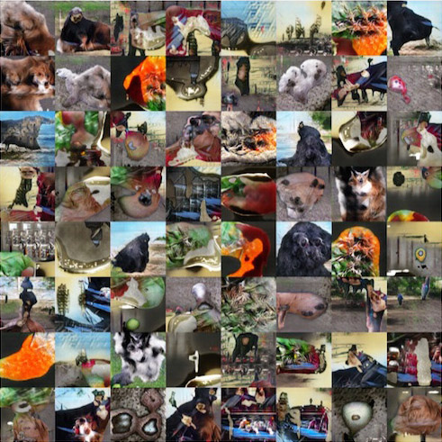

# An introduction to Generative Adversarial Nets

Generative Adversarial Networks (GANs) have captured the imagination of the deep learning community in the past year, and they have come to dominate the world of generative image modeling to an impressive degree. While we still struggle to generate images that are really plausible, for the first time we can produce big, sharp pictures of hundreds of different objects without building a renderer by hand. 

Here are a few examples from a GAN trained on 128x128 images from the ImageNet dataset[^improving-gans]:

Though none of these images quite manage to show real objects, their clarity and overall first-glance recognizability is absolutely stunning compared to similar results from not long ago.

Wow factor aside, what's going on under the hood? Why is it hard to generate an image? And why are GANs so good at it?

## The problem of generative modeling 

Researchers have been building generative models from raw data for years. The idea is that if you look at enough photos, for example, you should be able to create an image of your own that looks like a new photograph. But this is tricky, because how do you measure the quality of the new picture you generate? 

One straightforward metric for an image's quality is the **distance to its nearest neighbor.** Any image you generate should probably be "close" to some image in the dataset. If you had lots and lots of pictures of elephants in your dataset, any new image of an elephant that you create is likely to be broadly similar and have the same color palette, etc.

In principle, with an infinite number of example images, this is a great start at choosing an objective function! Imagine that you had every _possible_ image of an elephant in your ~~pocket universe~~ hard drive. Each time you you generate a correct image of an elephant, it's already on your hard drive! If it's not, your new image is not a good elephant photo, in which case it makes sense to see which elephant photo it's closest to, then make your photo more like that photo.

This update procedure, making your generated image $\hat{x}$ more similar to the most-similar image from the dataset, corresponds to minimizing the loss function
$$
\mathcal{L}(\hat{x}) = \min_{x \in data} (x - \hat{x})^2
$$
This equation says that the "error" for some image $\hat{x}$ that you create is simply how far it is from the most similar image in the dataset.

What if you only have a finite number of images?

<!-- Perhaps the set of all good elephant pictures forms a smooth manifold. That is, nearby to each elephant picture, there are a lot of other elephant pictures linearly related to it, so that if you made the picture one tiny $\epsilon$ brighter or dimmer, or more red or blue, you would find another elephant picture. -->

Think of your infinite elephant pictures as a plastic tarp, where every spot on the tarp corresponds to one photo in your infinite set. But if instead we have only $10^{100}$ images, it's more like a 5000 thread count silk sheet. It's still very smooth, and you definitely can't see through it, but in principle something very thin in just the right spot could go through without breaking any threads. There are at least _some_ elephant photos that aren't in your dataset.

Now what if you only have, say, one ImageNet of images: about a million. Even though a million images seems like a lot, they're spread across the space of _all possible natural images_. The dog in that photo _could_ roll a tiny bit to the left, and that photo isn't in your dataset. Once the light turns green in that intersection, that scene is no longer in your dataset. And neither is every instant after that! With only a million images, your fine silk sheets are more like a fishing net; they pretty much cover the whole area, but about 0% of allowable images are in your data.

So with a finite dataset, your model will always be spending a certain amount of effort over-optimizing. Maybe what it produced was a perfectly reasonable elephant picture, but since it wasn't in the dataset, the model tries to make it more like whatever random image happened to make it into the data. This can result in overfitting and also just inefficient learning.

## Encouraging variety

But there's an even worse caveat. The loss function we defined above trains your model to to _always_ produce images that are in the dataset, but does nothing to encourage it to produce _all_ the images in the dataset! Or, to put it another way, your model could have perfect _precision_, but terrible _recall_.

In the simplest case, your model could learn to always produce _the same image_. That is, every time you sample from your model, it gives you back the same image of an elephant, exactly copied from the dataset. But! You're a machine learning expert! You know the solution to this problem. You want to encourage diversity in your samples, so you add a regularization term to your model which penalizes it for generating which are too close together.

In practice this is quite difficult to get right. To exactly calculate this regularization term, you must compute the distance between every pair of images you create. Imagine that each image you generate is a ball, and between each pair of balls there is a spring pushing them away from one another. The closer two balls are together, the more they get pushed apart by their spring. If you have only a few image samples, this is relatively cheap to compute, but won't give a very accurate calculation of the regularization. And with more samples, the cost goes as $O(n^2)$, and will rapidly  dominate your training cost.

If only we had some sort of universal function approximator that we could use to amortize the cost of such a calculation...

## The GAN idea

Every few years I make a desultory attempt to learn how to draw. I never get very far, and each time I'm struck by the same thought: I have _no idea_ what a tree looks like. This is a really strange realization for someone who grew up in the suburbs.

Obviously it's not exactly true, either. If you showed me several photos, I would be able to tell you which ones have trees in them. I might even be able to say which of several quite good sketches was more realistic. But when the sketches are as bad as mine, I find I have no idea what I need to change to make them better. [^artist-eyes]

In some sense this is the problem GANs address.

### Model

A GAN consists of two components: a Generator and a discriminator (or Adversary). The generator is a function which maps random noise to images (or some other kind of data), and the discriminator is a function which maps images to a prediction of whether they're real (i.e. drawn from the dataset) or not.

During training, you sample random noise, then put it through the generator to produce something (hopefully!) image-like. Then you take that image and put it through the discriminator. Since you know that was a fake image, you can tell the discriminator that it was a negative (fake) example. Then you backpropagate through the discriminator to make it more likely to classify that image as fake.

At the end of backpropagation through the discriminator, you get gradients on the input to the discriminator which indicate which way you could perturb that input to make the discriminator more likely to classify it correctly. But now notice two facts:

1. The input to the discriminator is the output of the generator.
2. We can do a backward pass through the discriminator with the _wrong target_ to find out what we could change in the image to make the discriminator classify it as a real image.

<!-- The gradient of incorrect classification with respect to the image (i.e. how to change the photo to fool the discriminator) is the negative of the gradient of correct classification, which backprop already gave us. -->

We can use the gradients from the discriminator to train the generator! These gradients tell the generator exactly what it needs to change about this image in order to make it better (that is, to make it more likely to fool the discriminator). Since we're using the discriminator to tell the generator how well it's doing, we call this a _discriminitive loss function_ for the generator.

This clever use of a differentiable discriminitive model to evaluate the generated image is what makes the GAN a better artist than I am.

For the rest of this article, I'll be mostly talking about GANs as a way to train a good generator function. In this setting, the thing you want is a generative model for images, and after training the generator you will discard the discriminator.

## Why do GANs work so well?

There are a lot of differences between a GAN and something more traditional like an autoencoder, so it's worth briefly discussing them before we delve into the effects each one has. 

### Priors

For one thing, the GAN is a generative model with a well-defined prior. 

<!-- todo: cut down the autoencoder discussion -->

By contrast, imagine that you have only the generating half of an autoencoder and you want to generate an image similar to one in the training set. What input do you give that generator?

<!--  -->

The autoencoder training objective is $g(f(x)) \approx x$, so the domain of $g$ is the range of $f$. Intuitively, the only inputs that $g$ will be trained to deal with are those that $f$ actually produces over your dataset.

Naively, it could be that just about anything you give the decoder will produce a good image. One way to think about an autoencoder is that it compresses its input, and if it has optimally solved this task, any input in its domain should map to a valid output. That is to say, an optimal code has no unused bitstrings.

In practice, though, there doesn't seem to be much pressure for the autoencoder to fill its input space. Instead, a typical encoder will have some much smaller range embedded in the space of all the codes it could produce. As a result, most inputs you feed into the decoder won't generate anything like a real image. And it's not so simple as picking inputs in some particular range, which would correspond to just taking a rectangular slice of the space. That decoder's true domain could be _crazy_.[^variational-autoencoder]

Imagine you have a decoder that takes two real numbers $a$ and $b$ as inputs and generates images (or at least, image-shaped things). You might hope that if each input is between -1 and 1, like the blue square below, the decoder will produce a real image as its output. However, the decoder's real domain may be a crazy-looking manifold like the green curve, where only some combinations of $a$ and $b$ will produce good-looking images.

<!--  -->

With a GAN, sampling is baked right in. If the random noise you're using to feed the GAN is, say, $\mathcal{N}(0,1)$, likely samples from that distribution should produce likely-looking images, and unlikely samples will make somewhat weirder images. Conveniently, that prior doesn't have any holes; if $a$ is a point in the domain of the GAN, and $a + b$ is also in the domain, then $a  + \frac{1}{2} b$ is too. That's what lets people make those sweet face-arithmetic equations like in the DCGAN paper[^dcgan]: 

### Multimodal loss function

Another powerful feature of the GAN is that the discriminator provides a _multimodal_ loss function. In other words, the discriminator loss function thinks there are very many good images, whereas an autoencoder's mean-squared error is asking how far the produced image is from one image in particular.

This is a great property! Pixel-wise error is a terrible loss function and everyone knows it, but up until recently there haven't been a lot of alternatives. If the decoder of an autoencoder produces exactly the input image, but shifted left by one pixel, it may get a very large error. A GAN's discriminator, on the other hand, evaluates how "credible" it is that a given image appears in the dataset. That one-pixel-misaligned image will score very well.

The GAN discriminator loss also begins to solve a problem that we talked about earlier. If the loss function were merely evaluating how far an image is from the closest photo in the dataset, we might get a generator that always produces the same image for every input. With a GAN, though, the discriminator is trained together with the generator. As the generator learns to produce some single image, the discriminator learns that the generator always makes this one image, and so when it sees that image, it's probably a fake. 

The optimal discriminator function[^gan] is 
$$
D^*_G(x) = \frac{p_{data}(x)}{p_{data}(x) + p_g(x)}
$$
$p_{data}$ is the likelihood of an image under the dataset, and $p_g$ is the likelihood of the image under the generator. Remember that since this is a probability distribution, the sum over all images $x$ of $p_{data}(x)$ is $1$. For example, if this was a discrete distribution, we would have
$$
p_{data}(x) = \frac{\text{number of times }x\text{ appears in the data}}{\text{total number of data}}
$$
Intuitively, the optimal discriminator should say that an image is real (produce a $1$) if it's very likely under the dataset and there's only a small chance of the generator making that image. Conversely, if it's very likely that the generator would produce such an image, and/or it doesn't seem like it would be in the dataset, the discriminator should produce a $0$.

All this means that if the discriminator figures out that $p_g(x)$ is nearly 1, where the generator always produces the same image, it's going to give that image a very low score. To minimize $p_g(x)$, the generator has to make all the images it produces as different from one another as possible. This pushes the generator to make a lot of unrelated-seeming images while ensuring that each image $x$ is similar enough to the dataset that $p_{data}(x)$ is pretty high. 

Earlier we thought about trying to explicitly encourage samples from a generator to be far from one another in pixel space, but realized that it would be computationally intractible. In a sense the discriminator's implicit estimation of $p_g(x)$ is doing the same thing in a more principled way; it encourages the generator to spread out the images it produces as much as possible in the discriminator's feature space.

This is exactly what we were looking for! The discriminator loss function forces the generator to produce the _whole_ dataset, or as much of it as possible, instead of just requiring it to produce _only_ images from the dataset.

Or at least, that's the theory. In practice GANs often experience a phenomenon known as "collapse", in which the generator will produce only a few really different-looking kinds of images. This is possible because the discriminator isn't perfect, and it can't recognize _all_ the images that the generator produces. 

For example, if you train a GAN on pictures of a hundred different breeds of dogs, you might get a generator which only makes images of corgis, German shepherds, and golden retrievers. Especially if those breeds were the most common in the dataset, the discriminator may not be very confident that those examples are fake; it only has the power to "remember" a certain number of examples in its weights.

Preventing collapse and encouraging diverse images is an open problem. While there have been strong efforts in this direction (notably from OpenAI[^improving-gans]), nothing so far has been definitive.

### Training curriculum

By the end of training a GAN discriminator is able to do a pretty compelling job of evaluating how realistic an image is. In fact, a common problem in GAN training is that the discriminator may get too good at identifying the faked images. At that point, it's very difficult for the generator to learn; if everything it does is easily identified as a fake, there's no small change it can make to the image that will really improve its odds of tricking the discriminator.

It comes back to the conundrum of the beginner artist. If I'm so bad at drawing that my picture looks _nothing_ like a tree, it's pretty hard to say which one thing I should change.

With careful training, though, this won't happen. Instead, the generator and the discriminator will improve in sync, gradually producing images that are more like the dataset and discerning more detailed differences between real and fake images. In this scenario, the discriminator is not just one loss function for the generator. It is a series of slowly-evolving loss functions which converge toward pixel-perfect modeling of the data distribution.

The dynamics of this evolution would be _very_ interesting to study. I'm reminded of papers by David Duvenaud and Dougal Maclaurin[^early-stopping] as well as by Andrew Saxe[^learning-dynamics]. I would love to see similar ideas used to analyze the curriculum induced by GAN training.

<!-- The startling thing here is that somehow the order that the discriminator _happens_ to learn in creates a great curriculum for the generator. -->

<!-- In one sense, that's to be expected. After all, the discriminator is trained online against the generator. You can imagine that at each point, the discriminator finds a characteristic that is in some sense "most wrong" in the generated images, then penalized the generator for that characteristic. -->

<!-- But to make that statement more precise, we need to have a definition of what that "most wrong" thing is. While I -->

<!-- todo: discuss conditioning, prediction -->

<!-- todo: add caveats about amount of data required, extend thread-count metaphor -->

## Lots of questions left to answer

GANs are now state of the art for image modeling, and I'm sure there are countless papers applying them to different domains under development right now. Even so, there are a few big questions that are still open.

<!-- todo: explain that I mean image-conditioned GANs like for prediction -->

To me, the most pressing question is how to encourage the generator to produce diverse samples. Especially in conditional GANs, the tendency to collapse can be extremely strong. The discriminator would have to memorize a very large set of outputs to identify generated images, and in many settings it's difficult to produce diverse batches of correct samples to strengthen the discriminator.

Another open area is applying GANs to discrete domains. In a continuous domain like images, the generator can make a pixel just _slightly_ more red or _slightly_ less green to make the image as a whole more credible to the discriminator. By contrast, it's not clear how to make a generator for sentences produce a phrase slightly closer to "my fluffy pet kitty" than "my fluffy pet shark". While work has been done on adversarially generating language _embeddings_ instead of directly generating words[^adversarial-language], the challenge of adversarial training for discrete domains is still unanswered.[^discrete-gan-note]

<!-- todo: discuss oscillation -->

This is one of the fastest-moving areas of computer science and I'm very excited to see what comes out in the next year. With the number of great people working on generative modeling today we may not have to wait long for solutions.

[^artist-eyes]: I think this is what people mean when they say that someone has an artist's eye. Seeing the image your eye captures is a really different skill from just recognizing what's going on in a scene or where things are. People get so incredibly good at turning pixels into 3D models that we don't even know what the pixels look like!
[^variational-autoencoder]: Incidentally, this is a big part of the reason variational autoencoders are interesting. The prior of a variational autoencoder ensures that the range of the encoder, and hence the domain of the decoder, is fit to some distribution. That makes variational autoencoders very easy to sample from!
[^gan]: Goodfellow, Ian, et al. "Generative adversarial nets." *Advances in Neural Information Processing Systems*. 2014.
[^dcgan]: Radford, Alec, Luke Metz, and Soumith Chintala. "Unsupervised representation learning with deep convolutional generative adversarial networks."*arXiv preprint arXiv:1511.06434* (2015).
[^improving-gans]: Salimans, Tim, et al. "Improved Techniques for Training GANs." *arXiv preprint arXiv:1606.03498*(2016).
[^early-stopping]: Duvenaud, David, Dougal Maclaurin, and Ryan P. Adams. "Early Stopping as Nonparametric Variational Inference." *Proceedings of the 19th International Conference on Artificial Intelligence and Statistics*. 2016.
[^learning-dynamics]: Saxe, Andrew M., James L. McClelland, and Surya Ganguli. "Exact solutions to the nonlinear dynamics of learning in deep linear neural networks." *arXiv preprint arXiv:1312.6120* (2013).
[^adversarial-language]: Miyato, Takeru, Andrew M. Dai, and Ian Goodfellow. "Virtual Adversarial Training for Semi-Supervised Text Classification." *arXiv preprint arXiv:1605.07725* (2016).
[^discrete-gan-note]: While it's possible that GANs may never be completely adapted to discrete domains, it certainly feels like it should be possible to have the generator and discriminator operate in  probability space.